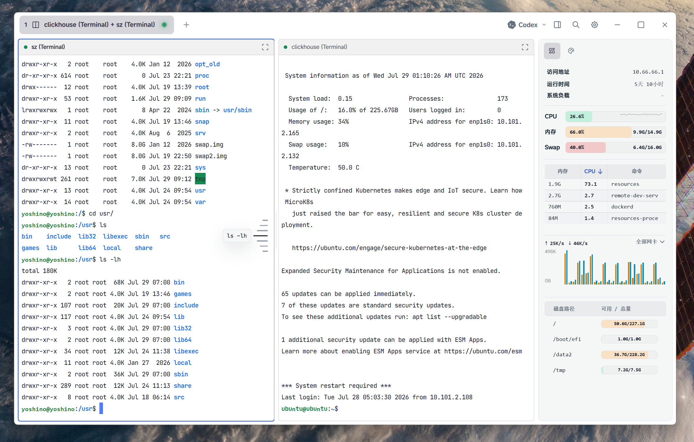

# CatShell

CatShell 是一个简洁的跨平台 SSH 工作区，专注于多会话终端、分屏操作和远程主机管理。

## 功能

- SSH 多会话与终端分屏
- CPU、内存、网络和磁盘监控
- 亮色与暗色主题
- Codex CLI 快速启动与状态查看

## 界面预览

### 分屏工作区

### Codex CLI 集成

### 暗色主题

> CatShell 正在持续开发中。
